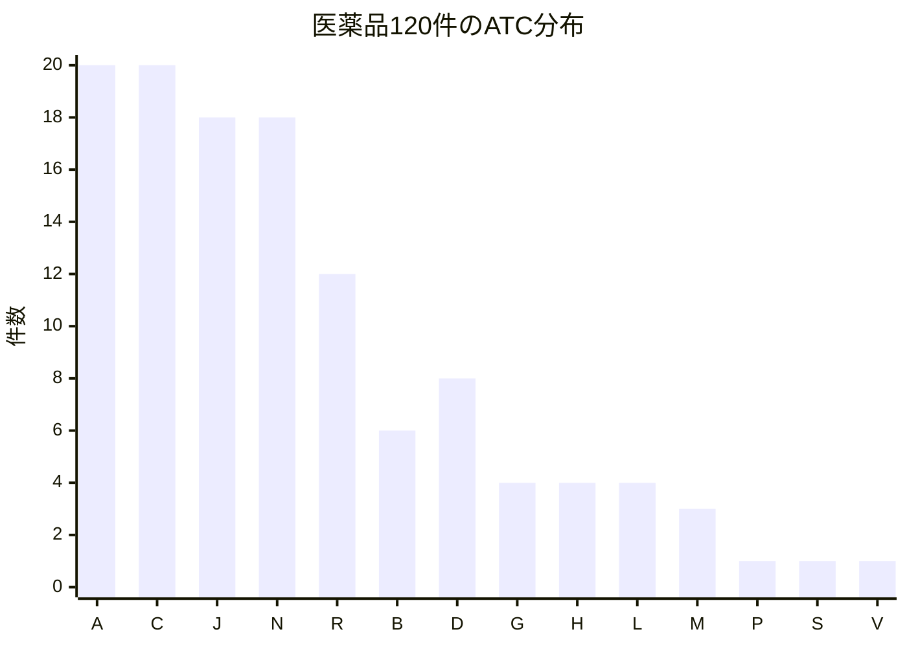
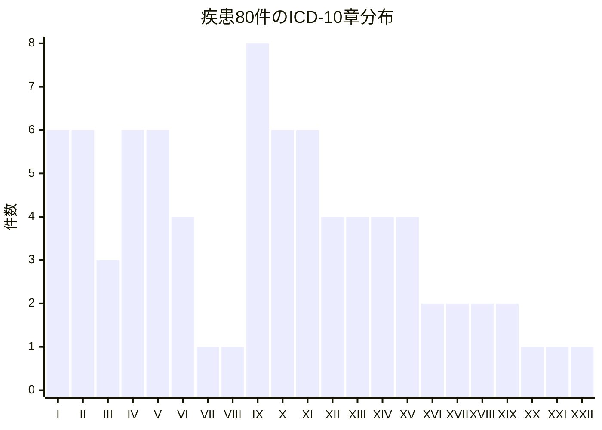
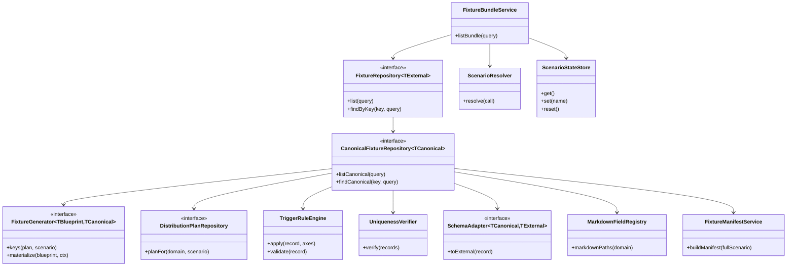
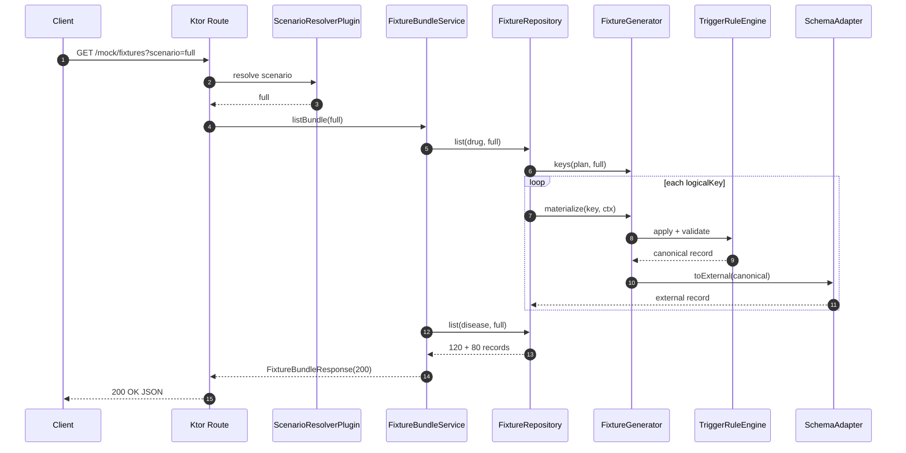
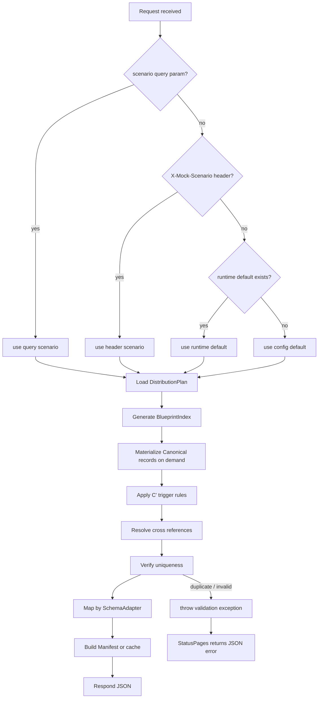

# Ktorモックサーバーの複雑な医薬品・疾患Fixture設計

## Executive summary

**定義**として、この要件に最も合うのは、**「内部では型付きの Canonical Fixture を生成し、外部では実データ構造に厳密一致する DTO へ変換する二層設計」**です。今回の前提では既存仕様の具体フィールド名・型をこの場で固定できないため、**外部契約のフィールド名・型はすべて「未指定」**として扱い、境界で `SchemaAdapter` に閉じ込めるのが安全です。Ktor はレイヤード構成、型安全ルーティング、プラグイン、JSON シリアライズ、テストホストを公式に備えているため、この分離は実装しやすく、TDD にも適しています。

**要点**は四つです。第一に、デフォルトシナリオは `full` とし、**医薬品 120 件 + 疾患 80 件 = 合計 200 件を必ず返す**こと。第二に、**各レコードは一意**で、しかも**同じ seed なら再生成結果も再現可能**にすること。第三に、**Markdown を含む文字列はサーバ側で描画せず、そのままの `String` として JSON に載せる**こと。第四に、シナリオ切替は **query parameter > header > ランタイム既定値 > 設定ファイル既定値** の優先順位で解決し、明示的な per-request 切替とグローバル既定値切替を両立させることです。既存仕様メモでも、件数の改訂、分類軸、追加ブロック発火条件、Markdown 文字列の保持方針が整理されています。  

**結論**としては、実装方針は **ハイブリッド**が最適です。すなわち、**120+80 の論理キーと分布計画だけを常駐**させ、実レコードは **オンデマンド生成**しつつ、**起動時に full シナリオを一度だけ検証・Manifest 化**し、必要に応じて **LRU キャッシュ**する方式です。200 件という規模だけを見れば全保持でも十分ですが、今後スキーマが増減したり Markdown パスが増えたりすることを考えると、**巨大な静的 JSON を直接 200 件ぶん手で保持するより、Distribution Plan と Trigger Rule を単一の真実源にする方が長期的に壊れにくい**です。Ktor 公式ドキュメントも、責務分離された構成、Repository の差し替え、fake repository を使ったテストを推奨しています。

| 論点 | 推奨設計 |
|---|---|
| デフォルト返却 | `full` シナリオで 200 件全件 |
| レコード構造 | 内部 Canonical + 外部 `SchemaAdapter` |
| 一意性 | `logicalKey` + `businessFingerprint` + checksum |
| シナリオ解決 | query > header > runtime > config |
| 生成方式 | ハイブリッド |
| テスト主軸 | Ktor `testApplication` + Kotest + JUnit 5 |
| 実装担当者 対応 | `AGENTS.md` + playbook + 明示的成功条件付きプロンプト |

**短い実装指示**: 先に「外部 DTO は未指定」「内部 Canonical でのみ型を持つ」という前提をコードベースに固定し、その後にシナリオ切替と full=200 の契約テストから始めてください。

**実装担当者に渡すプロンプト例**
```text
Ktor の mock server に対して、外部 payload の具体フィールド名は未指定として扱ってください。
まず Canonical Fixture + SchemaAdapter の二層構造を作り、default scenario=full で 200件返す契約テストを Red で追加してください。
full は drugs=120, diseases=80 を返し、各レコードが一意で、Markdown 文字列を保持し、seed で再現可能にしてください。
```

## Repository/Generatorパターン設計

**定義**として、ここでの Repository/Generator パターンは、**「Repository は問い合わせ単位の公開API」「Generator は一意キーから論理レコードを構築する純粋ロジック」**と切り分けるものです。Ktor 公式は、`config / plugins / controller(routes) / service / repository / domain / dto` のようなレイヤード構成を保守しやすい出発点として示しており、同時に Repository の差し替えで fake を使うテストも案内しています。Ktor には DI プラグインもありますが、この要件では **実装担当者 が一貫して生成しやすいように constructor injection か `AppDependencies` 1 個に寄せる**方が安定します。

**要点**は、**スキーマ未確定の境界を `SchemaAdapter` に隔離すること**です。内部では Kotlin の `data class`、`enum class`、必要なら `sealed interface` を使って生成規則を型安全に管理し、外部へ出す瞬間だけ、実データ構造に厳密一致する `JsonObject` または将来の `@Serializable` DTO へ変換します。`@Serializable` は serializer を自動生成し、`data class` は `equals/hashCode/copy/toString` を自動派生し、`sealed` は閉じたモデル集合を保証できます。

| 要素 | 種別 | 責務 | 公開API |
|---|---|---|---|
| `FixtureBundleService` | class | 医薬品・疾患を束ねて返すアプリ層 | `listBundle(query): FixtureBundleResponse` |
| `FixtureRepository<TExternal>` | interface | 外部向け Fixture 取得 | `list(query): List<TExternal>` / `findByKey(key, query): TExternal?` |
| `CanonicalFixtureRepository<TCanonical>` | interface | 生成済み Canonical の取得・キャッシュ | `listCanonical(query)` / `findCanonical(key, query)` |
| `FixtureGenerator<TBlueprint, TCanonical>` | interface | 論理キーから Canonical を生成 | `keys(plan, scenario): Sequence<TBlueprint>` / `materialize(blueprint, ctx): TCanonical` |
| `DistributionPlanRepository` | interface | `F` 分布計画とシナリオ定義を返す | `planFor(domain, scenario): DistributionPlan` |
| `TriggerRuleEngine` | class | `C'` 条件で追加グループ必須化 | `apply(record, axes): TCanonical` / `validate(record): List<Violation>` |
| `UniquenessVerifier` | class | 200 件の一意性・重複排除・checksum 検証 | `verify(records): Unit` |
| `SchemaAdapter<TCanonical, TExternal>` | interface | Canonical → 外部契約変換 | `toExternal(record): TExternal` |
| `ScenarioResolver` | class/plugin | query/header/runtime/config からシナリオ解決 | `resolve(call): ScenarioName` |
| `ScenarioStateStore` | class | ランタイム既定シナリオの保持 | `get()` / `set(name)` / `reset()` |
| `MarkdownFieldRegistry` | class | Markdown を含むパス定義 | `markdownPaths(domain): Set<String>` |
| `FixtureManifestService` | class | 起動時検証結果の保存 | `buildManifest(fullScenario): FixtureManifest` |

この分離により、**「分布」「発火」「一意性」「外部契約」を別々に testable** にできます。特に実フィールド名が未指定の現段階では、`SchemaAdapter` を 1 箇所にすることが重要です。そうすると、将来実データ構造が確定しても、**Generator と Trigger Rule をほぼそのまま残したまま**境界だけ差し替えられます。

**短い実装指示**: まず `FixtureRepository` と `FixtureGenerator` を分け、`SchemaAdapter` を別インターフェースとして切り出してください。外部構造が未指定の間は `JsonObject` を返して構いません。

**実装担当者に渡すプロンプト例**
```text
Kotlin/Ktor で、FixtureBundleService / FixtureRepository / FixtureGenerator / SchemaAdapter / ScenarioResolver / TriggerRuleEngine / UniquenessVerifier を分離して雛形を作成してください。
外部 DTO は具体フィールド名未指定のため JsonObject 境界で実装し、将来 DTO に差し替え可能なインターフェースにしてください。
```

## データ分布設計とC'発火ルール

**定義**として、`F` 分布設計は **120+80 の件数配分と UI カバレッジを同時に満たすための割当表**であり、`C'` は **分類軸が立ったときに追加フィールド群を必須化するルール**です。既存仕様メモでは、医薬品は ATC 群ベース、疾患は ICD-10 章ベースで分布が設計されており、さらに注射剤・生物由来製品・感染性疾患・新生物・循環器などの分類ごとに追加ブロックの発火条件が整理されています。 

**要点**として、医薬品の 120 件は次の配分をそのまま採用するのが最も自然です。これは ATC の主要群に厚く配分しつつ、注射剤、向精神薬、麻薬、生物由来製品、吸入剤、点鼻液、点眼液などの UI 分岐を最低 1 回以上発火させるためです。既存仕様メモでも A/C/J/N/R 群を厚く配し、B/D などを補助群として置いています。

| 医薬品分布 `F-drug` | 件数 |
|---|---:|
| ATC A 群 | 20 |
| ATC C 群 | 20 |
| ATC J 群 | 18 |
| ATC N 群 | 18 |
| ATC R 群 | 12 |
| ATC B 群 | 6 |
| ATC D 群 | 8 |
| ATC G 群 | 4 |
| ATC H 群 | 4 |
| ATC L 群 | 4 |
| ATC M 群 | 3 |
| ATC P 群 | 1 |
| ATC S 群 | 1 |
| ATC V 群 | 1 |
| 合計 | 120 |



**比較**すると、疾患の 80 件は 22 章を最低 1 回ずつ出しながら、特に第 I・II・IV・V・IX・XI 章に厚めに寄せる設計が合理的です。これは感染性、重症度分類、精神科系、急性冠症候群系など、追加ルールの発火密度が高い章にボリュームを持たせるためです。既存仕様メモもこの 6 章に合計 38 件、その他 16 章に 42 件を配しています。

| 疾患分布 `F-disease` | 件数 |
|---|---:|
| I | 6 |
| II | 6 |
| III | 3 |
| IV | 6 |
| V | 6 |
| VI | 4 |
| VII | 1 |
| VIII | 1 |
| IX | 8 |
| X | 6 |
| XI | 6 |
| XII | 4 |
| XIII | 4 |
| XIV | 4 |
| XV | 4 |
| XVI | 2 |
| XVII | 2 |
| XVIII | 2 |
| XIX | 2 |
| XX | 1 |
| XXI | 1 |
| XXII | 1 |
| 合計 | 80 |



**具体例**として、`C'` 発火ルールは次のように抽象化できます。ここではユーザー要件に合わせ、**実フィールド名はすべて「未指定」**とし、**概念名だけ**を置きます。実装時には既存仕様メモの具体構造へ 1:1 にマッピングしてください。 

| 分類軸 `C'` | 発火対象グループ概念 | 必須化テンプレート |
|---|---|---|
| 注射系医薬品 | 投与手順相当 / PK相当 | 両方とも非空 |
| 外用系医薬品 | 適用上注意相当 | 非空 |
| 生物由来・特定生物由来 | 警告相当 / 取扱い注意相当 | 両方とも非空 |
| 毒薬・劇薬 | 警告相当 | 非空 |
| 向精神薬・麻薬 | 保険・処方制限相当 | 非空 |
| 慢性長期服用薬 | 用量関連注意相当 | 非空 |
| 感染性疾患 | 予防相当 / 発症様式相当 / 危険因子相当 | 3 群とも必須 |
| 新生物 | 重症度分類相当 / 予後相当 | 両方とも必須 |
| 内分泌・代謝 | 検査相当 / 薬物療法相当 | 両方とも必須 |
| 循環器系 | 重症度分類相当 / 急性期プロトコル相当 | 両方とも必須 |
| 精神・行動障害 | 診断基準相当 / 関連薬参照相当 | 両方とも必須 |
| 妊娠関連 | 性差・妊娠相当 / 禁忌薬除外ルール | 両方とも必須 |

ここで重要なのは、**シナリオは分布を変えるもの、`C'` はレコード内容を変えるもの**と割り切ることです。つまり `full` / `infectious-focus` / `markdown-edge` のようなシナリオがどの blueprint を採用するかを決め、採用された blueprint 上で `C'` が追加グループを必須化します。この二段階にすると、件数の説明責任と内容の説明責任を分けてテストできます。

**短い実装指示**: `DistributionPlan` と `TriggerRuleEngine` は別クラスにしてください。分布と追加フィールド発火を 1 クラスに混ぜると、件数テストと内容テストが分離できなくなります。

**実装担当者に渡すプロンプト例**
```text
医薬品120件と疾患80件の DistributionPlan を定数として実装してください。
別クラス TriggerRuleEngine を作り、分類軸ごとに追加グループを必須化してください。
外部 payload のフィールド名は未指定なので、概念名ベースの内部 Canonical モデルとして実装してください。
```

## シナリオ切替機構

**定義**として、シナリオ切替は **「per-request override」と「global default override」を同時に提供する仕組み」**です。Ktor は query parameter、header、設定ファイル、型安全ルーティング、カスタムプラグイン、例外処理を公式に持っているため、これらを素直に組み合わせれば実装できます。`Resources` プラグインでは query parameter を持つ `@Resource` クラスを定義でき、Ktor の custom plugin は `createApplicationPlugin` と `onCall` でリクエスト段階に処理を差し込めます。また `StatusPages` は例外や status code ベースの JSON エラー応答に使えます。

**要点**として、優先順位は次で固定してください。こうしておくと、E2E テスト、手動 QA、CI、ローカル再現が全部わかりやすくなります。

| 優先順位 | 入力源 | 目的 |
|---|---|---|
| 高 | query parameter `scenario` | 単発の E2E / 手動検証 |
| 中 | header `X-Mock-Scenario` | クライアント共通設定・環境切替 |
| 低 | ランタイム状態 `ScenarioStateStore` | 管理 API での既定値切替 |
| 最低 | 設定ファイル `application.conf` / `application.yaml` | 起動時既定値 |

**比較**すると、query parameter は再現性と可観測性が高く、header は共通注入が楽で、ランタイム切替は QA に向き、設定ファイル既定値は CI やローカル起動に向いています。最終的には **全部持つ**のが最も運用しやすいです。設定ファイルは HOCON/YAML を Ktor が標準サポートしており、テストでは `MapApplicationConfig` でプログラム的に差し替えられます。

| エンドポイント | 用途 | 挙動 |
|---|---|---|
| `GET /mock/fixtures?scenario={name}&domain=all` | 200 件バンドル返却 | 既定は `full`、`full` で 200 件 |
| `GET /mock/drugs?scenario={name}` | 医薬品のみ | `full` で 120 件 |
| `GET /mock/diseases?scenario={name}` | 疾患のみ | `full` で 80 件 |
| `GET /mock/admin/scenario` | 現在の既定値確認 | 現在の runtime default を返す |
| `PUT /mock/admin/scenario` | 既定値変更 | body で新シナリオ名を受ける |
| `POST /mock/admin/scenario/reset` | 既定値リセット | config default に戻す |

**具体例**として、シナリオは次のように切っておくと現実的です。`full` 以外も**すべて構造的に正しい fixture**だけを返し、**不正データシナリオは公開 API には載せない**ようにしてください。不正系のテストは Generator / Validator の unit test で扱う方が安全です。

| シナリオ名 | 件数の目安 | 目的 |
|---|---:|---|
| `full` | 200 | 既定。全件返却 |
| `smoke` | 12〜20 | UI 分岐の最小スモーク |
| `infectious-focus` | 24 前後 | 感染性+注射系の検証 |
| `regulatory-focus` | 24 前後 | 生物由来・劇薬・向精神薬の検証 |
| `markdown-edge` | 20 前後 | 改行・箇条書き・強調の検証 |
| `pregnancy-safe` | 16 前後 | 禁忌薬除外ルール確認 |

管理 API の `PUT /mock/admin/scenario` は request body を受けるので、ここだけは `RequestValidation` を使うとよいです。Ktor の `RequestValidation` は body 検証に使え、失敗時は `RequestValidationException` を投げ、それを `StatusPages` 側で `400` JSON に統一できます。

**短い実装指示**: query/header/runtime/config の優先順位はコードコメントではなくテストで固定してください。`ScenarioResolverTest` と `RouteContractTest` の両方で同じルールを検証してください。

**実装担当者に渡すプロンプト例**
```text
ScenarioResolverPlugin を createApplicationPlugin で実装してください。
優先順位は query scenario > header X-Mock-Scenario > runtime default > config default です。
unknown scenario は InvalidScenarioException を投げ、StatusPages で 400 JSON に変換してください。
```

## Fixture生成戦略

**定義**として、この要件で比較すべき戦略は **オンメモリ全保持**、**オンデマンド生成**、**ハイブリッド**の三つです。Ktor で JSON 応答を返すこと自体は `ContentNegotiation` で素直に扱えますが、件数・一意性・Markdown・シナリオ差分・将来のスキーマ変更まで考えると、どこに「真実源」を置くかが本質です。

| 観点 | オンメモリ全保持 | オンデマンド生成 | ハイブリッド |
|---|---|---|---|
| 実装容易性 | 最も高い | 中 | 中 |
| メモリ効率 | 低 | 高 | 高 |
| シナリオ差分管理 | 低 | 高 | 高 |
| 一意性検証 | 中 | 中 | 高 |
| Markdown の扱い | 容易 | 容易 | 容易 |
| 変更時の保守性 | 低 | 中 | 高 |
| 起動時検証 | 容易 | 別設計が必要 | 容易 |
| 推奨度 | 可 | 可 | **最良** |

**要点**として、**推奨はハイブリッド**です。実装は次の 6 ステップにすると安定します。

1. **BlueprintIndex 生成**
   `drug-001..120` と `disease-001..080` 相当の内部 `logicalKey` だけを先に作る。
2. **DistributionPlan 適用**
   `F-drug` / `F-disease` で各 key に分類軸を割り当てる。
3. **TriggerRule 適用**
   `C'` により追加グループ概念を強制発火させる。
4. **ReferenceGraph 解決**
   医薬品→疾患、疾患→医薬品などの参照関係を二段階で解決する。
5. **SchemaAdapter 変換**
   実データ構造に厳密一致する外部 `JsonObject` / DTO に変換する。
6. **Manifest 検証とキャッシュ**
   起動時に `full` を一度だけ materialize して `count / keys / checksum` を固め、その後は on-demand + cache で返す。

この構成なら、**レスポンス時には 200 件を直接ソースコードにべた書きしなくても**、**CI と起動時に 200 件全件の妥当性を先に証明**できます。

**比較**の観点で最も重要なのは再現性です。Kotlin の `Random(seed)` は、**同じ seed なら同じ Kotlin runtime version の範囲で同じ列を返す**一方、**将来の Kotlin version ではアルゴリズムが変わる可能性**があり、さらに **JVM 上の seeded generator は thread-safe ではない**と明記されています。したがって、seed 再現性に依存するなら、**`generatorVersion` を Manifest に保存し、Random は request ごとに新しく作る**設計にしてください。

**Markdown 処理**はサーバ側で複雑化させない方が得です。既存仕様メモと整合する最小設計は、**Markdown を含む箇所を単なる `String` として保持し、サーバは JSON に直列化するだけ**にすることです。`@Serializable` と Ktor の `ContentNegotiation` があれば、文字列としてそのまま安全に流せます。サーバ側でやるべきことは **改行の正規化（LF 統一）**、**Markdown を含むパス一覧の保持**、**round-trip equality テスト**、**過剰 escaping をしないこと**だけです。

**具体例**として、スキーマが固定されたあとに snake_case を選ぶなら注意点があります。`JsonNamingStrategy.SnakeCase` は便利ですが、**名前変換はグローバルに適用**され、`@SerialName` にも影響し、**変換後の衝突は deserialization exception**につながります。したがって、**実データ構造が厳密であるほど、最終 DTO では明示的 `@SerialName` を優先し、SnakeCase は「衝突監査済み」の場合だけ使う**のが安全です。

**短い実装指示**: `full` を起動時に一度だけ生成して `FixtureManifest` を作り、その Manifest に `generatorVersion`、`seedBase`、`logicalKeys`、`payloadChecksums` を保存してください。

**実装担当者に渡すプロンプト例**
```text
全200件をコード上に直接保持しない前提で、BlueprintIndex + DistributionPlan + TriggerRuleEngine + SchemaAdapter + FixtureManifest の流れを実装してください。
Random(seed) は request ごとに生成し、generatorVersion も Manifest に保存してください。
Markdown を含むパスは registry で管理し、サーバ側では描画せず String のまま JSON にしてください。
```

## TDDプラン

**定義**として、この要件の TDD は **「まず HTTP 契約を固定し、その後に分布・発火・一意性・再現性を unit test で詰める」**順番が最も効率的です。Ktor の `testApplication` は実サーバを起動せずにアプリケーション呼び出しを内部処理できるため速く、`environment { config = ... }` と `MapApplicationConfig` による環境差し替えもできます。さらに `externalServices {}` で外部サービスの模擬も可能です。

**要点**として、テスト最小単位は次のように分けるのがよいです。Kotest は assertion・property testing・data-driven testing が強く、JUnit 5 は parameterized / nested 構造や既存ツールチェーンとの相性が良いので、**Ktor route 契約は JUnit 5 か標準 runner、ロジック検証は Kotest**という分業が実践的です。Kotest は `forAll` / `checkAll`、data-driven test、seed 追跡を持ち、JUnit 5 は `@ParameterizedTest` と `@Nested` による行列テストがやりやすいです。

| テスト対象 | 最小単位 | 主な失敗条件 | 推奨ライブラリ |
|---|---|---|---|
| `ScenarioResolver` | pure unit | 優先順位が崩れる | JUnit 5 / Kotest |
| `DistributionPlan` | pure unit | 120 / 80 / bucket 件数が崩れる | Kotest |
| `TriggerRuleEngine` | pure unit | `C'` 発火漏れ | Kotest |
| `UniquenessVerifier` | property test | 重複 key / 重複 fingerprint | Kotest |
| `MarkdownFieldRegistry` | pure unit | Markdown パス漏れ | Kotest |
| `SchemaAdapter` | contract unit | 未指定構造への変換漏れ | JUnit 5 |
| `FixtureRepository` | service test | seed 非再現 / sorting 不安定 | Kotest |
| Ktor route | integration | `full` が 200 件でない / error JSON 不整合 | Ktor test host |
| admin route | integration | invalid scenario が 400 にならない | Ktor test host |

**比較**として、Red→Green は次の順に進めると手戻りが少ないです。

| ステップ | Red で書くテスト | Green で入れる最小実装 |
|---|---|---|
| 契約固定 | `GET /mock/fixtures` が 200 件を返す | hard-coded `full` ScenarioResolver |
| 分割固定 | 120+80 の内訳が一致する | minimum DistributionPlan |
| 優先順位固定 | query/header/runtime/config の順になる | ScenarioResolverPlugin |
| 一意性固定 | 200 件全部の logicalKey が一意 | UniquenessVerifier |
| 発火固定 | `C'` ごとの追加グループが埋まる | TriggerRuleEngine |
| 再現性固定 | 同じ seed で一致、別 seed で差分 | Generator + GenerationContext |
| Markdown 固定 | Markdown パスが verbatim で返る | MarkdownFieldRegistry |
| エラー固定 | invalid scenario が 400 JSON | StatusPages + custom exception |
| 管理固定 | admin で runtime default が変わる | ScenarioStateStore |

**具体例**として、Kotest の property seed 機能は非常に相性が良いです。seed を固定すれば同じ失敗を恒久回帰テストにできますし、失敗時 seed の保存もできます。したがって、**「乱択 generator を使うが CI は deterministic」**という方針に向いています。JUnit 5 側では、Kotlin で `@MethodSource` や `@BeforeAll` を扱いやすくするために `PER_CLASS` を使う選択もあります。

**モック/統合テスト例**としては次の三本を必須にしてください。

- **Route 契約テスト**: `GET /mock/fixtures` → `200 OK`、件数 200、error envelope 不在。
- **シナリオ優先順位テスト**: same request で query/header/runtime/config の組み合わせが期待通りになる。
- **Generator 再現性テスト**: `seed=42` を二回流すと一致し、`seed=43` で checksum が変わる。

**短い実装指示**: 最初のコミットでは route 契約テストと ScenarioResolverTest だけを書き、Generator 実装は後回しにしてください。先に API 契約を凍らせる方が 実装担当者 の出力が安定します。

**実装担当者に渡すプロンプト例**
```text
TDD で進めます。最初に次の Red テストだけを追加してください。
1) GET /mock/fixtures は default full で 200件
2) query/header/runtime/config のシナリオ優先順位
3) invalid scenario は 400 JSON
テストが失敗する状態を作ったあと、最小実装で Green にしてください。
```

## 実装担当者向け実装指示とコードスニペット

**定義**として、実装担当者 は、**コードベースを読み、ファイルを編集し、コマンドを実行し、複数ファイルにまたがる変更を扱える implementation support tool** です。公式ドキュメントは、**成功条件を先に定義すること**、**プロンプトは self-contained にすること**、**必要なら playbook に長いプレイブックを分離すること**を推奨しています。playbooks は `SKILL.md` に定義でき、**body は使われたときだけ読み込まれる**ので、長い fixture 生成ルールをそこへ退避する構成と相性が良いです。

**要点**として、実装担当者 に渡す実装指示は次の三層に分けると安定します。

| 配置 | 役割 | 内容 |
|---|---|---|
| `AGENTS.md` | リポジトリ共通ルール | テスト先行、外部 payload は未指定、`full=200` 契約、コード規約 |
| `.claude/playbooks/mock-fixture/SKILL.md` | 長文プレイブック | DistributionPlan、TriggerRule、Manifest、seed ルール |
| issue / prompt 本文 | 今回の作業単位 | どのテストを追加し、どのファイルを作り、どこまで Green にするか |

**比較**すると、「1 本の巨大プロンプトに全部を書く」よりも、**共通ルールは AGENTS.md、長い手順は playbook、今回の変更点だけを prompt** に書く方が再利用性と一貫性が高いです。implementation tooling のドキュメントも、成功基準の明確化と、長い参照情報を繰り返し貼らずに再利用する方法を推しています。

**具体例**として、Kotlin / Ktor の雛形は次の程度から始めるのがよいです。ここではユーザー要件どおり、**実 payload の具体フィールド名は「未指定」**としており、外部境界は `JsonObject` に留めています。

```kotlin
package com.example.fixture

import kotlinx.serialization.Serializable
import kotlinx.serialization.json.JsonObject

enum class DomainKind { DRUG, DISEASE }

@JvmInline
value class LogicalKey(val value: String)

data class FixtureQuery(
    val scenario: String,
    val domain: DomainKind? = null,
    val ids: Set<LogicalKey> = emptySet(),
)

data class GenerationContext(
    val scenario: String,
    val seedBase: Long,
    val generatorVersion: String,
)

data class CanonicalFixture(
    val key: LogicalKey,
    val domain: DomainKind,
    val axes: Map<String, String>,          // 例: 分類軸。外部フィールド名は未指定
    val concepts: Map<String, Any?>,        // 例: 概念ベースの内部表現
    val markdownPaths: Set<String>,
)

interface FixtureGenerator {
    fun keys(query: FixtureQuery): Sequence<LogicalKey>
    fun materialize(key: LogicalKey, ctx: GenerationContext): CanonicalFixture
}

interface SchemaAdapter {
    fun toExternal(record: CanonicalFixture): JsonObject
}

interface FixtureRepository {
    suspend fun list(query: FixtureQuery): List<JsonObject>
    suspend fun findByKey(key: LogicalKey, query: FixtureQuery): JsonObject?
}

@Serializable
data class FixtureBundleResponse(
    val scenario: String,
    val totalCount: Int,
    val drugs: List<JsonObject>,
    val diseases: List<JsonObject>,
)
```

Ktor 側は `Resources`、`ContentNegotiation`、`StatusPages` を基礎にし、シナリオ解決は custom plugin で流し込むのが素直です。`Resources` は query parameter を持つ typed route をサポートし、`ContentNegotiation` は JSON 直列化、`StatusPages` は例外→JSON エラーの統一に使えます。

```kotlin
package com.example.plugins

import com.example.fixture.FixtureBundleResponse
import com.example.fixture.FixtureRepository
import io.ktor.http.HttpStatusCode
import io.ktor.resources.Resource
import io.ktor.resources.serialization.ResourcesFormat
import io.ktor.server.application.*
import io.ktor.server.plugins.contentnegotiation.*
import io.ktor.server.plugins.statuspages.*
import io.ktor.server.resources.*
import io.ktor.server.response.*
import io.ktor.server.routing.*
import io.ktor.serialization.kotlinx.json.*
import io.ktor.util.*
import kotlinx.serialization.Serializable
import java.util.concurrent.atomic.AtomicReference

class InvalidScenarioException(message: String) : RuntimeException(message)

class ScenarioState(initial: String) {
    private val current = AtomicReference(initial)
    fun get(): String = current.get()
    fun set(value: String) { current.set(value) }
    fun reset(defaultValue: String) { current.set(defaultValue) }
}

val ResolvedScenarioKey = AttributeKey<String>("resolved-scenario")

fun scenarioResolverPlugin(
    state: ScenarioState,
    allowed: Set<String>,
    configDefault: String,
) = createApplicationPlugin(name = "ScenarioResolver") {
    onCall { call ->
        val scenario =
            call.request.queryParameters["scenario"]
                ?: call.request.headers["X-Mock-Scenario"]
                ?: state.get()
                ?: configDefault

        if (scenario !in allowed) {
            throw InvalidScenarioException("Unknown scenario: $scenario")
        }
        call.attributes.put(ResolvedScenarioKey, scenario)
    }
}

@Serializable
@Resource("/mock/fixtures")
data class FixturesResource(
    val scenario: String? = null,
    val domain: String? = null, // all / drug / disease
)

fun Application.fixtureModule(
    repository: FixtureRepository,
    scenarioState: ScenarioState,
    defaultScenario: String = "full",
) {
    install(Resources)
    install(ContentNegotiation) { json() }
    install(StatusPages) {
        exception<InvalidScenarioException> { call, cause ->
            call.respond(
                HttpStatusCode.BadRequest,
                mapOf("code" to "INVALID_SCENARIO", "message" to (cause.message ?: "invalid scenario"))
            )
        }
    }
    install(
        scenarioResolverPlugin(
            state = scenarioState,
            allowed = setOf("full", "smoke", "infectious-focus", "regulatory-focus", "markdown-edge"),
            configDefault = defaultScenario,
        )
    )

    routing {
        get<FixturesResource> {
            val scenario = call.attributes[ResolvedScenarioKey]

            val drugs = repository.list(
                com.example.fixture.FixtureQuery(
                    scenario = scenario,
                    domain = com.example.fixture.DomainKind.DRUG,
                )
            )
            val diseases = repository.list(
                com.example.fixture.FixtureQuery(
                    scenario = scenario,
                    domain = com.example.fixture.DomainKind.DISEASE,
                )
            )

            call.respond(
                FixtureBundleResponse(
                    scenario = scenario,
                    totalCount = drugs.size + diseases.size,
                    drugs = drugs,
                    diseases = diseases,
                )
            )
        }
    }
}
```

テストテンプレートは Kotest を主体にしつつ、Ktor の `testApplication` と `MapApplicationConfig` を組み合わせると書きやすいです。Ktor 公式は `testApplication` と `MapApplicationConfig` による環境差し替えを案内しており、Kotest は data-driven と property-based の両方を持っています。

```kotlin
package com.example.fixture

import io.kotest.core.spec.style.FunSpec
import io.kotest.datatest.withData
import io.kotest.matchers.collections.shouldHaveSize
import io.kotest.matchers.shouldBe
import io.ktor.client.request.get
import io.ktor.server.config.MapApplicationConfig
import io.ktor.server.testing.testApplication
import kotlinx.serialization.json.Json
import kotlinx.serialization.json.jsonObject
import kotlinx.serialization.json.jsonPrimitive

class FixtureRouteTest : FunSpec({

    test("default full returns 200 records") {
        testApplication {
            environment {
                config = MapApplicationConfig(
                    "mock.fixture.defaultScenario" to "full"
                )
            }
            application {
                fixtureModule(
                    repository = buildRepositoryForTest(),
                    scenarioState = com.example.plugins.ScenarioState("full"),
                    defaultScenario = "full",
                )
            }

            val response = client.get("/mock/fixtures")
            response.status.value shouldBe 200

            val json = Json.parseToJsonElement(response.bodyAsText()).jsonObject
            json["totalCount"]!!.jsonPrimitive.int shouldBe 200
        }
    }

    withData(
        nameFn = { "query=${it.query ?: "-"} header=${it.header ?: "-"} expected=${it.expected}" },
        ScenarioCase(query = "markdown-edge", header = "full", expected = "markdown-edge"),
        ScenarioCase(query = null, header = "infectious-focus", expected = "infectious-focus"),
        ScenarioCase(query = null, header = null, expected = "full"),
    ) { case ->
        testApplication {
            application {
                fixtureModule(
                    repository = buildRepositoryForTest(),
                    scenarioState = com.example.plugins.ScenarioState("full"),
                    defaultScenario = "full",
                )
            }

            val url = buildString {
                append("/mock/fixtures")
                if (case.query != null) append("?scenario=${case.query}")
            }

            val response = client.get(url) {
                case.header?.let { header("X-Mock-Scenario", it) }
            }

            val json = Json.parseToJsonElement(response.bodyAsText()).jsonObject
            json["scenario"]!!.jsonPrimitive.content shouldBe case.expected
        }
    }
})

data class ScenarioCase(
    val query: String?,
    val header: String?,
    val expected: String,
)
```

**短い実装指示**: 実装担当者 には、毎回「どのファイルを作るか」「どのテストを先に落とすか」「DTO は未指定のため `JsonObject` 境界にすること」を明示してください。

**実装担当者に渡すプロンプト例**
```text
<task>
Ktor mock server に Fixture architecture を実装してください。
</task>
<success_criteria>
- GET /mock/fixtures の契約テストが通る
- default scenario=full で totalCount=200
- scenario precedence が query > header > runtime > config
- 外部 payload は具体フィールド未指定のため JsonObject 境界
</success_criteria>
<constraints>
- Repository / Generator / SchemaAdapter / TriggerRuleEngine を分離
- 先に Red テストを書いてから最小実装で Green
- markdown は server で描画しない
</constraints>
```

## 必要なテーブルと図

本レポートで必要な**比較表**・**分布表**・**テスト表**は前節までに配置しました。ここでは実装ドキュメントへそのまま貼れる **クラス図**、**シーケンス図**、**フローチャート**をまとめます。図の構成は、Ktor 公式が示すレイヤード構造、typed routing / plugin ベースの処理フロー、testable な責務分離に合わせています。







これらの図が表している設計上の要諦は、**Scenario 解決は request 単位で早い段階に行う**、**生成ロジックは外部 DTO から切り離す**、**一意性と Trigger Rule は route の奥ではなく repository/service 層で保証する**、の三点です。そうしておくと、full シナリオの 200 件契約、各 preset scenario の subset 契約、Markdown 保持、seed 再現性を、それぞれ別レベルのテストで固められます。

**短い実装指示**: まず `docs/fixtures-architecture.md` を作り、この 3 つの Mermaid 図と前節の表を入れてください。実装担当者 にはコード生成と同時に設計文書も更新させる方が一貫します。

**実装担当者に渡すプロンプト例**
```text
docs/fixtures-architecture.md を作成し、Repository/Generator/ScenarioResolver/TriggerRuleEngine を対象にした Mermaid の classDiagram, sequenceDiagram, flowchart を追加してください。
図は実装コードの命名と一致させ、README からリンクしてください。
```